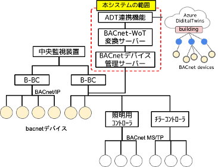
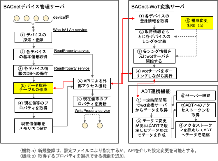
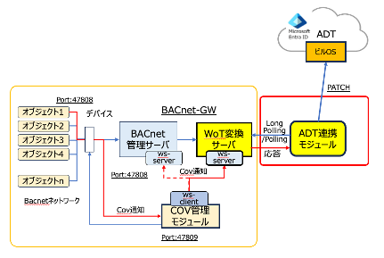

  

【秘密】 関係者外秘 

##### BACnet-GWの要求仕様書（0.32版）    

（COV通知機能・ポーリング機能追加）

  

  令和7年2月28日   
  国立大学法人大阪大学D３センター   
  下西研究室
  

---

目次[松山1]
1	概要	2
1.1	背景・目的	2
1.2	システム構成図	2
2	本仕様書で開発するシステムの構成概要	3
2.1	BACNET管理機能	3
2.2	BACNET-WOT変換機能	4
2.3	COV通知機能	5
2.4	ADT連携機能	6
3	機能要件	6
3.1	BACNET管理機能	6
3.1.1	BACnetデバイス探索機能（図２　機能?@）	6
3.1.2	BACnetデバイスの基本情報の取得・保存機能（図２　機能?A?B）	6
3.1.3	BACnetデバイスの現在値等の取得・保存機能（図２　機能?C）	10
3.1.4	特定デバイスの現在値プロパティの更新機能（図２　機能?D）	10
3.1.5	APIサーバ機能（図２　機能?E）	10
3.1.6	COV管理モジュールからのCOV通知を受信／送信及びデータの同期化機能	11
3.2	BACNET-WOT変換機能	11
3.2.1	登録デバイスの情報の取得機能	15
3.2.2	デバイスの振る舞いを定義するシング定義機能	15
3.2.3	差分データ転送機能及非同期通信を実現するEvent機能	17
3.2.4	各シング情報を元にWOTサーバを開始する機能	19
3.2.5	登録デバイス情報の監視機能	20
3.2.6	COV管理モジュールからのCOV通知を受信及び送信する機能	20
3.3	ID変換機能	21
3.3.1	データーベースの構成	21
3.3.2	データーベース操作機能	22
3.4	COV通知機能	24
3.4.1	デバイス情報取得機能	24
3.4.2	送信・受信機能	24
3.4.3	登録情報取得機能	24
3.4.4	登録/解除機能	25
3.4.5	COV通知機能	27
3.4.6	その他COV管理サーバーの機能	27
3.5	AZURE DIGITAL TWINS連携機能	29

---

3.5.1	HTTPプロトコルによる実装例	29
(1)	プッシュ型の送信クライアント機能	29
(2)	連携機能を制御するサーバー機能	29
3.5.2	MQTTプロトコルによる実装例	30
(1)	PUBサーバー機能（クライアント機能含む）（BACnet-GW）	30
(2)	MQTTクライアント機能（監視クライアント：ビルOS含む）	30
3.5.3	COV通知機能を想定した実装例	32
4	開発環境	33
4.1	BACNET管理機能	33
4.2	BACNET-WOT変換機能	34
4.3 実行環境	35
4.4参考	36
4.4.1 BACnet対応CO２センサーの実装	36
4.4.2 BACnetの各仕様定義	36
4.4.3 ファンコイルエミュレータの実装（評価用）	37
4.4.4 WOT化に向けたBACnetの仕様の検討	37

---

#### 1. 概要

1. 背景・目的  
　これまで、ダイキン工業の提供する空調関連のAPI基盤であるDK-CONNECTを用いて、空調デバイスのWOT(Web of Things)化を推進し、W3Cの標準規格に則り各空調機へアクセスするための方法論を展開してきた。特に前年度は、その応用の一つとしてWOTとして認識された各空調デバイスを、Azureデジタルツインと連携する仕組みを提案、構築してきた。
　2023年度は、昨年度の成果を発展させ、DK-CONNECT以外の他社機器/設備をビルOSに接続する際に更に、使いやすいシステムの開発を目指す。特に、ビルの統合的な管理システムであり、事実上デファクトスタンダードとなっているBACnetとの接続性を実現することにより、他社接続に向け更に、柔軟かつシームレスなシステムの構築が期待できる。  

1. システム構成図
　図１に本システムの全体構成を示す。赤線の枠内が本システムの範囲である。本システムの前提としては、図にある通り従来の中央監視装置を置き換えることではなく、これを並列してビル内のBACnetデバイスの情報をビルOSに提供することを想定する。すなわち、ビル内の各機器の（ミッションクリティカルな）監視・制御は従来の中央監視装置が担っていることを前提に、同時に各機器の情報を収集し、ビルOS上にビルのデジタルツインを構築することで、新たな付加価値を持ったビルアプリケーションの実現を可能とすることを目的とする。したがって、本BACnet GWにおいては、ビル内の各機器の制御を行うことを否定はしないが、主な役割としてはデータの収集にあるものとする。
　本BACnet-GWは図1にある通り、BACnetデバイス管理サーバ機能とBACnet-WoT変換サーバ機能に加えてADT（Azure Digital Twin）連携機能で構成される。これらは物理的に３台のサーバ（クライアントを含む）で構成されるということを意図するものではなく、BACnet-GWがこれらの３つの機能モジュールを持つことを意図したものである。

【図1】　建物内のBACnetによるビル管理システムのネットワークイメージ

</div">

#### 2. 本仕様書で開発するシステムの構成概要

図２に本システムの機能概要を示す。

1.  BACnet管理機能
以下の７つの機能で構成される
    1. デバイスの探索機能
    2. 取得したデバイスの基本情報の取得機能
    3. 上記取得情報のDBへの保存機能
    4. 各デバイスの経時的変化のある情報の取得機能
    5. 特定デバイスの現在値プロパティの更新機能
    6. 各BACnetデバイスの情報取得または、デバイス操作を実行するためのAPIサーバー機能
    7. COV管理モジュールからのCOV通知を受信／送信及びデータの同期化機能

【図2】　BACnet-WOT変換システムの構成図

---
2. BACnet-WOT変換機能
　以下の7つの機能で構成される
  1. BACnetデバイス管理サーバから定期的に登録デバイスの情報の取得機能
  1. 取得したデバイスのプロパティ情報を元にデバイスの振る舞いを定義するシングのテンプレートの作成機能
  1. 各シング情報を元にWOTサーバを開始する機能（WOTサーバーの再起動は、制御用仮想シングを用いてキックする）
  1. 各WOTサーバは、BACnetデバイス管理サーバのAPIを介してデバイスの最新情報をポーリングしてシングとの同期化を行う機能
  1. デバイス登録情報の監視の結果、登録デバイス情報に変更（追加・削除）があったときに管理者が再構成有無を判断し、現在のWOTサーバを停止させ、再度新しい構成としてWOTのサービスを開始する機能
  1. COV管理モジュールからのCOV通知を受信及び送信する機能
  1. COV通知によるデータ同期化及びロングポーリング応答機能

- COV通知機能
標記機能は、追加のオプション機能として構成される。
図３にCOV通知機能（COV管理モジュール）を追加した場合の構成図を示す。

【図３】　COV管理モジュールを追加した全体のシステムの構成例
　以下の５つの機能で構成される
1. デバイス情報取得機能
1. WebSocketを用いた送信・受信機能
1. 登録情報取得機能
1. 登録/解除機能
1. COV通知機能

- ADT連携機能
　以下の５つの機能で構成される
?@ BACnet-WOT変換機能から定期的に各WOTのプロパティ値を取得する機能
?A WOTのプロパティ値に変更があればADT側で規定されたフォーマットに変換する機能
?B ADTへのアクセスに必要なトークンを認証サーバーから取得する機能
?C 上記アクセストークンを?Aで作成したデータに付与してジタルツインへ送信するクライアント機能
?D ADTを含む外部クライアントからのリクエストに応じて応答するサーバー機能。具体的なサーバー機能としては、デジタルツインへの送信開始、停止及び、更新間隔設定機能を含む。
?E WOT変換サーバーにロングポーリングを行い応答データに基づきPATCH処理する機能

---
#### 3. 機能要件

　以下、各節で各機能要素の機能で上記の仕様を説明する。以下、今回新規開発する機能について述べる。
　
	1. BACnet管理機能
		1. BACnetデバイス探索機能（図２　機能?@）  

* BACnetデバイスに実装されているDiscoveryサービス（Who-Is/I-am）機能を用いて、配下にあるデバイス情報を発見し、データーベースに登録する。一定時間ごとに動作させることにより最新の情報を保持するものとする。想定デバイス数は、100台程度として、B-BC単位ごとに配置することとする。新規登録は、設定ファイルにより指定するか、APIを介した設定変更を可能とする。

		1. BACnetデバイスの基本情報の取得・保存機能（図２　機能?A?B）
* デバイス情報を収集するためにBACnetの基本サービスRead Propertyサービスを使用する。そして、収集したデバイス情報をもとに、各デバイスのオブジェクト及びプロパティ情報を管理情報として保存する。
* 各デバイスの情報は、変更頻度が高くないプロパティ情報（デバイス固有）は、データーベース等に格納する。（例：オブジェクト名、計測値の最大値や最小値及び計測値の単位など）
* BACnetデバイスのIdentifierの範囲を指定して、グループ単位で管理できるようにする。
* フィールド環境の既設のシステムに於いてBACnetデバイスのIdentifierが事前にわからない場合を想定して、発見したデバイスを自動的に登録するしくみも考慮しておく。

【表3-1】　BACnet管理サーバ設定ファイル（箕面C対応改訂版） ver.0.5.4
項目
キー
設定値（例）
Who-Is発行間隔
whois_interval
Default: 60秒
現在値の更新頻度
update_interval
Default: 30秒 < Who-Is発行間隔
死活判定期間
window_size
Default: 5分
グループ管理用デバイスId列
group_ids
Default: なし(0〜4194303)⇒文字列
自動登録の時：['*']
サーバポート番号
port
Default: 5000
サーバーアドレス
addr
ネットマスクとIPアドレス("172.16.0.123/16")
BACnetポート
bacn_port
47808
自動登録モード時の最大デバイスId
max_ids
Default: 0
自動登録の時に設定する。0値の時に最大値とする。
対象とするオブジェクト型
object_list
オブジェクト型の配列
マルチプルREAD未対応デバイスの指定
multiple_unsupported
　Default:[] （ex: ["11"]）
マルチプルREAD対応デバイスの最大プロパティ数の指定
multiple_n_partitions
Default: 100
READ対象オブジェクト指定ファイル名
alive_list
Default: ""

(具体例)
設定ファイル： config_v1.json
{
  "whois_interval": 60, 
  "update_interval": 30, 
  "window_size": 5, 
  "port": 5001,
  "addr": "192.168.100.4/24",
  "bacn_port": 47808,
  "group_ids": ["11", "5001-5010"],
  "max_ids": 0,
  "object_list": ["analogInput", "analogOutput", "analogValue", "binaryInput", "binaryOutput",
    "binaryValue", "multiStateValue", "multiStateInput'", "multiStateOutput", "device"],
  "multiple_unsupported": ["11"],
  "multiple_n_partitions": 100,
  "alive_list": " "alive_demo,json""
}

対象オブジェクト指定ファイル
以下のオブジェクト構成とする。
キー：　デバイスID
値：　オブジェクトIDのリスト
具体例は以下のとおり。ファイル名：alive_demo.json

【表3-1a】　BACnet管理サーバ設定ファイル（箕面C対応改訂版） ver.0.6.7
項目
キー
設定値（例）
Who-Is発行間隔
whois_interval
Default: 60秒
現在値の更新頻度
update_interval
Default: 30秒 < Who-Is発行間隔
死活判定期間
window_size
Default: 5分
グループ管理用デバイスId列
group_ids
Default: なし(0〜4194303)⇒文字列
自動登録の時：['*']
サーバポート番号
port
Default: 5000
サーバーアドレス
addr
ネットマスクとIPアドレス("172.16.0.123/16")
BACnetポート
bacn_port
47808
自動登録モード時の最大デバイスId
max_ids
Default: 0
自動登録の時に設定する。0値の時に最大値とする。
対象とするオブジェクト型
object_list
オブジェクト型の配列
マルチプルREAD未対応デバイスの指定
multiple_unsupported
　Default:[] （ex: ["11"]）
マルチプルREAD対応デバイスの最大プロパティ数の指定
multiple_n_partitions
Default: 100
READ対象オブジェクト指定ファイル名
alive_list
alive_list_minho.json
オブジェクトのポーリング指数定義ファイル名
interval_list
interaval_def.json

（例）　interval_def.json

---
3.1.3 BACnetデバイスの現在値等の取得・保存機能（図２　機能?C）
　現在値など経時的に変化するプロパティは、ポーリングによりメモリー上に保存することとする。
データ更新のポーリング時間は、基本タイムスロット時間をベースに、その整数倍として任意に設定可能とする。なお、各オブジェクト毎の設置も様々な場面での応用も考慮して追加する。初期計測頻度は、初期設定ファイルで指定することとする。また、計測頻度は、API機能に計測頻度変更サービスを作成することにより運用中に更新可能とする予定である。
　Propertyの読み出しは、3．1．2同様に、基本的にRead Propertyサービスにより実現する。また、取得の効率化に対してRead Property Multipleサービスも必要に応じて追加する。COVサービスに関しては、本仕様書においてはスコープ外とする。
　
　以下は本仕様書における性能要件の見積もりである。ここでは性能要件として、1[min]ごとのデータの取得を想定し、同様のデバイスが100個ぶら下がると仮定する。以下100個のデバイスの全プロパティを取得する時間を見積もる。
　1[min]ごとの要件を前提にすると、60[sec]以内には、全てのデバイスの現在値を更新する必要があるが、余裕をみて30[sec]ごとに更新を行う。
　1個のデバイスあたり許容される取得時間　=　30[sec]/100 = 300 [msec] 
　従って、300[msec]以内に１デバイスが保持するすべてのオブジェクトの現在値を取得する必要がある。例えば、現在のCO2センサの対象オブジェクトは５つ存在しており、現時点の評価ではこの要件は満たしている。現在の実装では、全デバイスからシリアルに読み取りを行っているが、接続台数や読み取り間隔などの要件や、BACnet-GWを実装するデバイスの性能などによって、パラレルに読み取りを行うなどの変更が必要になる可能性がある。

　以上から、目標値は表3-2のとおりとする。
　
　
【表3-2】
項目
目標値
BACnetオブジェクト数
全オブジェクト総数10,000程度
現在値の更新頻度
5秒以上、任意に設定可能とする
現在値の取得時間
最大300msec未満(1デバイス当たり)?

---
3.1.4 ポーリングスケジュール機能（図２　機能?C）
　基本タイムスロット時間をベースにその整数倍として定義したポーリング間隔において、各オブジェクトのプロパティをどのタイムスロットで取得するかを決定する以下のモードを設ける。

?@  単純な間引きモード
本モードは、間引き無しの標準モードの含む。
?A 完全randomizeモード
上記?@で単純に間引くと、各タイムスロット内に割り当てた取得オブジェクトの数にバラツキが生じるために、タイムスロット毎のデータリクエスト数および、そのデータ取得時間にバラツキが生じてしまう。そのためにタイムスロット毎に割り当てるオブジェクト数が平準化できるように一様乱数を用いてスケジュールする仕様とする。
?B 部分randomizeモード
上記?Aのモードと異なるのは、デバイス内で同じ周期でデータ取得するオブジェクト（プロパティ）のタイミングを同じタイムスロット内に収める点である。

【表 3-3】　各モードとモード指標との関係表
mode
説明
0
単純な間引きモード
1
完全randomizeモード
2
部分randomizeモード（デバイス内で拘束）

3.1.5 特定デバイスの現在値プロパティの更新機能（図２　機能?D）

　特定デバイスのプロパティ値を更新するためにBACnetのWrite Propertyサービスを実装して実現する。具体的な想定イメージは、WOT側からの設定値変更やコマンドの発出に伴いBACnetデバイスに対してそれらのコマンドを実行することとする。

3.1.6 APIサーバ機能（図２　機能?E）
　各デバイスの情報または、デバイス操作は、API機能を実装することにより実現する。例えば、各デバイスの現在値情報であれば、メモリ上の該当データを抽出してリクエストに応答することとする。また、デバイスに対する操作コマンドに対しては、外部サーバからアクセス時に、または、実行可能とする。
【表3-3】
APIのサービス機能
応答形式
入力形式
登録デバイスのプロパティ情報の取得
JSON

登録デバイスのノードリスト（IPアドレス）の取得
JSON

応答しているデバイスのノードリスト（IPアドレス）の取得
JSON

応答している全デバイスの現在値の取得
JSON

応答しているデバイスのうち特定デバイスの現在値の取得
JSON

特定デバイスへの書き込み機能
JSON
JSON
管理対象デバイスのIdの追加及び、削除機能
JSON
JSON
各デバイスの取得オブジェクトとプロパティの設定
JSON
JSON

3.1.7 COV管理モジュールからのCOV通知を受信／送信及びデータの同期化機能

* COV管理モジュールをWebSocketクライアントとして随時通知を受信可能なようにWebSocketサーバーを構成しする。
* 通知を受信したタイミングで該当オブジェクトの現在値を通知内容に従い書き換えるように構成する。

3.2 BACnet-WOT変換機能

　BACnet管理機能と適時通信を行い、現時点でのデバイス情報を取得する。取得したデバイス情報をもとに、デバイスタイプに応じたシングを生成する。管理サーバの情報は、BACnet-WOT変換サーバ起動時に設定ファイルとして定義する。
　設定ファイルとしては、以下の情報を含む。

【表3-4】　ver.0.4.9
項目(constants)
説明
初期値
url
BACnetデバイス管理サーバのアクセスポイント
Default: localhost:5000
db_url
mysql処理サーバーのアクセスポイント
Default: localhost:3000
interval
現在値ポーリング周期
Default: 30秒
update_interval
WOTのプロパティ値の監視時間
Default: 3秒
diff_interval
WOTのプロパティ値の差分時間
Default: 60秒
proto
Discoveryプロトコル
Default: mdns
test
DBの利用有無
Default: false（利用）
devIds
デバイス名の共通prefix
Default: []

項目(event_objects)
説明
具体例
device_id
デバイスのId 
500１
object
以下のオブジェクトの配列で定義キー：オブジェクトId
値：以下のオブジェクトを定義
キー：イベント名、説明、イベント対象のオブジェクトの型とその値
[{"binaryValue:1": {
  "event_name": "bv",
  "description": "The state of the sensor.",
  "type": "boolean"}}]

具体例：bacnet_test_event.json
{
  "constants":  {
      "url": "http://192.168.100.15:5000",
      "db_url": "http://192.168.100.15:3000",
      "port": 8000,
      "interval": 30,
      "polling": 60,
      "update_interval": 3,
      "diff_interval": 60,
      "proto": "mdns",
      "test": false,
      "devIds": ["aaa"]
  },
  "event_objects": [
    {
      "device_id": 599,
      "object": [{"multiStateValue:1": {
        "event_name": "update_interval","description": "The event for the updated interval time."
      }}]
    },
    {
      "device_id": 5001,
      "object": [{"binaryValue:1": {
        "event_name": "bv","description": "The state of the sensor.","type": "boolean"
      }}]
    },
......................................................................................................
    {
      "device_id": 5020,
      "object": [{"binaryValue:1": {
        "event_name": "bv","description": "The state of the sensor.","type": "boolean"
      }}]
    },
    {
      "device_id": 5021,
      "object": [
        {
          "binaryValue:0": {
          "event_name": "bi_0","description": "The state of the sensor.","type": "string"
          }
        },
        {
          "binaryValue:1": {
          "event_name": "bi_1","description": "The state of the sensor.","type": "string"
          }
        },
        {
          "binaryValue:2": {
          "event_name": "bi_2","description": "The state of the sensor.","type": "string"
          }
        },
             .........................................................................................................
        {
          "binaryValue:9": {
          "event_name": "bi_9","description": "The state of the sensor.","type": "string"
          }
        }
      ]
    }
  ]
}
ver.0.5.7以降（Event定義の書式変更）
具体例：bacnet_light_event.json

---
3.2.1 登録デバイスの情報の取得機能
* BACnetデバイス管理サーバ（BACnet管理機能）から定期的に登録デバイスの情報を取得する。
* BACnetデバイス管理サーバのアクセスポイント及び、探索周期は設定ファイルから取得する。

3.2.2 デバイスの振る舞いを定義するシング定義機能
* 取得したデバイスのプロパティ情報を元にデバイスの振る舞いを定義する。具体的には、以下のような定義項目がある。（セクション6を参照）
* 特にidに関しては、外部のDBサーバに予め登録したuuidをもとに設定することとして、事前に登録がない場合に関してのみ自動生成することとする。下図参照）これによりビルOSの等のクライアントで決定したIdとの整合性を担保することが可能となる。

                        【図3】

【表3-5】 シングを定義（実装中のCO2センサーを例に記載）
種類
型
Thing Descriptionへのマッピング
値（例）
id
string
urn:bacnet:uuidなど一意の値を定義
DBサーバからBacnet IDに対応したuuidを取得して設定、尚未定義の場合は自動生成
"id": "urn:bacnet:c79df5d2-ec64-4367-9d5c-88572625440a",
title
string
BACnetデバイスのオブジェクト名を割当
BACnetのdeviceオブジェクトの名前を設定する。
"title": ""rapi3_device",
@type
Array
[string]
BACnetデバイスの種類がわかるように定義
[BACnet-Device]
Properties
JSON
・プロパティ名は、BACnetデバイスの各オブジェクトに対して定義しているオブジェクト名を割当てる。
・titleは、上記プロパティ名の説明
・typeは、上記プロパティ値の型
・@typeは、上記プロパティのタイプ

・オブジェクトにminPresValue又は、maxPreValueが定義されていればTDのminimum及びmaximumに割当てる。
・オブジェクトが、AnalogInput又はBinaryInputならばreadOnlyキーを追加してtrueをセットする。
・unitsが定義されていれば、"unit"キーに割当てる。
概要のキーがBACnet側になければTDには生成しない。

以下を参照。
bacpypes/py34/bacpypes/basetypes.py at master ? JoelBender/bacpypes ? GitHub

{
  "CO2_av": {
  "title": "co2 concentration",
  "type": "integer",
  "@type": "LevelProperty",
  "minimum": 0,
  "maximum": 9999.,
  "readOnly": true,
  "unit": "partsPerMillion",
  "description": ".......",
},
{
  "temp_ai": {
  "title": "temp_ai",
  "type": "number",
  "@type": "LevelProperty",
  "minimum": 0.0,
  "maximum": 55.0,
  "readOnly": true
  "unit": "degreesCelsius",
  "description": ".......",
},

Actions
JSON
POST系の操作があれば定義する

Events
JSON
状態／警報監視用に追加

【表3-6】変換対象オブジェクト型（９種類に限定）
オブジェクト型
対象
読み書き
TDに追加するキー
analogInput
状態値
read
readOnly: true
analogValue
状態／設定値
read/write
readOnly: false
writeOnly: false
analogOutput
設定値
write
writeOnly: true
binaryInput
状態値
read
readOnly: true
binaryValue
状態／設定値
read/write
readOnly: false
writeOnly: false
binaryOutput
設定値
write
writeOnly: true
multiStateInput
状態値
read
readOnly: true
列挙型キーenumを追加してstateTextを割り当てる。
multiStateValue
状態／設定値
read/write
readOnly: false
writeOnly: false
列挙型キーenumを追加してstateTextを割り当てる。
multiStateOutput
設定値
write
writeOnly: true
列挙型キーenumを追加してsteteTextを割り当てる。

---

3.2.3 差分データ転送機能及非同期通信を実現するEvent機能
　監視型クライアントを想定して、取得データを以下の２つに分類してデータ型に応じた転送機能を実装する。
?@ 時系列計測データの監視
　時系列計測データとしては、基本的に対象となるデバイスのプロパティーを一定時間ごとにすべて収集する。したがって本データに対しては、ビルOS側から定期的にポーリングして、あるいは任意のタイミングで全データの読出しを行う。
　ただし、変化のないデータを毎回読みだすことはシステムへの負荷が大きいため、変化のあったデータだけを通知して個別に読み出す機能も提供する。
?A 状態及び警報などの非同期データの監視
　WoTおいては、非同期に発生するイベントの通知として、HTTP long-pollingとWebSocketの2つの方法が示されている(https://wot-jp-cg.netlify.app/docs/basicsequence/)。本仕様書に基づく今回の実装では、実装負担の少ないlong pollingを用いた実装を行うとする。

・Long-pollingの実装例
https://www.turtle-techies.com/long-pollng-nodejs/
を参考にして、以下のイベントエミッタの実装を行う。

Event.js
【コード1】

下図に、クライアントからのリクエストによってサーバーがイベントを登録及び実行する流れを示す。サーバーは、クライアントからリクエストを受けるとイベントを登録する。そして応答するデータの準備ができるまで現状を保持する。データが準備できた段階でクライアントにデータを応答する流れとなる。

具体的な、サーバーのイベント処理部分のコードの一部を参考までに以下に示す。
Server.js
【コード2】
............................................................................................................................
app.get('/', function (req, res) {
   const id = Date.now().toString(); // milliseconds of now will be fine for our case
   var timer = null;
   const handler = function(event) {
      clearTimeout(timer);
      console.log('event', event);
      res.status(201);
      res.end( JSON.stringify(event));
   };

   eventEmitter.register(id, handler);
   timer = setTimeout(function(){ 
      console.log('timeout');
      const wasUnregistered = eventEmitter.unregister(id);
      console.log("wasUnregistered", wasUnregistered);
      if (wasUnregistered){
         res.status(200);
         res.end();
      }
   }, 5000);
});
......................................　省略　...................................................................................

3.2.4 各シング情報を元にWOTサーバを開始する機能
* MozillaのWeb thingsのフレームワークに従いWOTサーバを起動する。
* 各WOTサーバは、BACnetデバイス管理サーバのAPIサービスを介してデバイスの最新情報をポーリングしてシングとの同期化を行う。
* クライアントアプリ（ADTを含む）からデバイスへの操作を伴う場合は、WOTサーバから、BACnetデバイス管理サーバを介して各デバイスにコマンドを送信する。

【図4】

---

3.2.5 登録デバイス情報の監視機能
　BACnetデバイス管理サーバからの登録デバイス（ノード）の情報を保持しておく。次回、監視時に登録ノードに変更がなければ、一定時間後再度登録ノードを調べる。登録ノードに変更（追加・削除）を検知したら、現在のサーバを停止させる。再度新しいデバイス情報を管理サーバからから取得して、シングの構成を再定義する。その後、再度WOTのサービスを開始する。
　
3.2.6 COV管理モジュールからのCOV通知を受信及び送信する機能

 　BACnet管理サーバーの構成と同様に、COV管理モジュールをWebSocketクライアントとして随時通知を受信可能なようにWebSocketサーバーを構成する。

COV通知によるデータ同期化及びロングポーリング応答機能

通知を受信したタイミングで該当プロパティの現在値を通知内容に従い書き換えるように構成する。同時に、通知内容に従いイベントエミッターをトリガーしてロングポーリングへの応答を作成してクライアントに返す構成とする。

下図に具体的な例としてCOV通知とロングポーリングへの応答までの流れを示す。

---

3.3 ID変換機能
　図３のID変換モジュールに対応する機能である。シングの生成時にそのwot_idとBACnetデバイスIdとの紐づけを主におこなう機能を担う。当初、デバイスIdには一つのシングの対応を想定していたが、実環境への適用時（箕面CにおけるBACnetシステム）に、そのBACnetデバイス自体に論理的なデバイスの構造が保持しうることが判明したために以下のように拡張を行う。基本的にデバイスIdとwot_idは１対１対応するが、デバイスが２つ以上のシングで構成されていることを示すためにシーケンスIdを新たに導入する。以下に具体的なデータベースの設計例を参考までに提示しておく。
3.3.1 データーベースの構成

マスターレコードは、デバイスIdとwot_id及び論理的に何番目のシングになるのかを明示するためのseq_idで構成される。更に、付随的にそのデバイスが論理構造を持つ場合には、オブジェクト管理レコードを作成して以下のように、そのシングwot_idを構成するオブジェクトを構成数だけ作成する。
(a) マスターレコード
【表3-7】
id
bigint(20) NOT NULL AUTO_INCREMENT COMMENT 'id',
sub_system_id
TEXT
device_id
MEDIUMINT
seq_id
INT
wot_id
VARCHAR(255)
created_at
TIMESTAMP NOT NULL DEFAULT CURRENT_TIMESTAMP COMMENT '作成日時',
updated_at
TIMESTAMP  NOT NULL DEFAULT CURRENT_TIMESTAMP ON UPDATE CURRENT_TIMESTAMP COMMENT '更新日時',
(b) オブジェクト管理レコード
【表3-8】
id
bigint(20) NOT NULL AUTO_INCREMENT COMMENT 'id',

wot_id
VARCHAR(255)
object_id
VARCHAR(20)
alias
VARCHAR(80)
created_at
TIMESTAMP NOT NULL DEFAULT CURRENT_TIMESTAMP COMMENT '作成日時',
updated_at
TIMESTAMP  NOT NULL DEFAULT CURRENT_TIMESTAMP ON UPDATE CURRENT_TIMESTAMP COMMENT '更新日時',
因みに、オブジェクト管理レコードにaliasカラムを設けているがオブジェクトをwot変換した場合に、デフォルトではオブジェクト名をwotのプロパティにマッピングする仕様を想定しているが、標記aliasカラムを定義することにより任意にユーザーが付与する名前に置き換えることを可能とする。

3.3.2 データーベース操作機能

　前節で定義したデータベースを操作刷るための機能を実現する。
下表に具体的な操作一覧を示す。因みに、id_map2: マスターレコード及びobject_map2: オブジェクト管理レコードに対応する。（id_map及びobject_mapは、仕様変更前に使用していた形式）

【表3-9】
サービスポイント
メソッド
クエリ
ボディ
説明
/create_table
POST
tbl=id_map
　
新規テーブルの作成。
注) id_map及びobject_mapは、旧版との整合性の為に残す

default: id_map2

/ceate_data
POST
　
index_nを追加
wot_idの自動生成。

indexカラムを追加。
/insert
POST
tbl=object_map
indexを追加
indexカラムを追加に対応

default: id_map2

/map_object
GET
device_id

wot_idとobject_idとの紐づけ
クエリaliasで、object_map2のレコードを取得する

index
　

alias
　

POST
device_id
　
alias=1の場合、object_map2のレコードにデータを登録する。
alias_names: 文字列の配列で定義する。

index
　

alias
　

/inquire
GET
tbl, wot_id,
　
　

device_id
　

/register
GET
tbl=id_map2
　
　

object_map
　

/table_remove
DELETE
tbl=id_map2
　
テーブルを削除

object_map
　

具体的な操作手順は、以下のとおり。
@host = db_url
1. マスターテーブルの作成
   POST {{host}}/create_table?tbl=id_map2
   Content-Type: application/json

2. マスターテーブルに登録
・deviceIdの5001から5020を新規登録
POST {{host}}/create_data
Content-Type: application/json

{
   "tbl": "id_map2",
    "sub_system_id": "bacnet",
    "device_ids": ["5001-5020"],
    "index_n": 1
}

3. オブジェクトテーブルの作成（論理構造がある場合）
POST {{host}}/create_table?tbl=object_map2
Content-Type: application/json

4. オブジェクトテーブルに登録（照明デバイスの場合）
   POST {{host}}/map_object_all?alias
   Content-Type: application/json

< ./object.json

object.json（具体例）:

3.4 COV通知機能
3.4.1 デバイス情報取得機能
・同一ネットワークに接続されているBACnetデバイスの情報を取得する機能 

3.4.2 送信・受信機能
・COV登録クライアントから受信は、WebSocketを用いるとともに、各サーバーへのCOV通知も即時性を担保するためにWebSocketを用いて構成することとする。 

3.4.3 登録情報取得機能
・現時点で各BACnetデバイスに設定されているCOV登録情報を取得する機能

3.4.4 登録/解除機能
・COVによる通知設定を対象とするBACnetデバイスのオブジェクトに対して行うとともに、不要となった設定を削除するための機能

・コマンド受信仕様（実装例）：
【表3-10】
基本形式

キー名
型
説明
header
オブジェクト
?@を参照
body
オブジェクト、
オブジェクトの配列
?A、?Bを参照

?@headerキー
登録／解除

キー名
型
説明
version
整数
バージョン指定
messageType
文字列
commandRequest'固定値
messagePurpose
文字列
SubscribeCOV, UnSubscribeCOV,
COVList, WhoIS

?Abodyキー
登録

キー名
型
説明
addr
文字列
対象デバイスのIP
objectIds
文字列
オブジェクトId
lifetime
整数
通常0を設定

?Bbodyキー
解除

キー名
型
説明
addr
文字列
対象デバイスのIP
group
オブジェクトの配列
?Cを参照
lifetime
整数
通常1を設定

?Cgroupキー（以下のオブジェクトの配列）

キー名
型
説明
proc_id
文字列
対象デバイスのIP
objectId
文字列
オブジェクトId
登録時データ例：
解除時データ例：

登録時データ例（複数指定）：
3.4.5 COV通知機能
・COV設定したBACnetデバイスからCOV通知を受取ってBACnet管理サーバー及びWOT変換サーバーに転送する機能

3.4.6 その他COV管理サーバーの機能
・上記機能をCOV管理クライアントから利用するために以下の機能を備える。

以下、実装例を示す。
【表3-11】
各コマンド（使用法）
引数
型
必須
備考
説明
upload <filename.json>
<filename.json>
文字列
◯
登録/解除用ファイル名
登録/解除用ファイルをcov管理モジュールに送信する。
covlist <min/*> [max]  
<min/*>
整数
◯
デバイスId最小値
*は、ワイルドカード
min〜maxまでのデバイスIdのcov登録状況を取得する。

[max] 
整数

デバイスId最大値

dblist
　

　
現在登録されているデバイスIdとアドレスの情報を取得する。
whois <min/*> [max] [broadcast]
<min/*>
整数
◯
デバイスId最小値
WhoIsによるmin〜maxまでのデバイスIdの情報の取得を行う。

Broadcast（例）: 192.168.100.25:47809

[max]
整数

デバイスId最大値

[broadcast]
文字列

ブロードキャスト

add_db <addr> <device_id>
<addr>
文字列
◯
デバイスのIPアドレス
　

<device_id>
整数
◯
デバイスId

remove <device_id>
<device_id>
整数
◯
デバイスId
　

---

3.5 Azure Digital Twins連携機能
3.5.1 HTTPプロトコルによる実装例
 Azure Digital Twins（以下ADTと表現）側の現在の仕様は、外部クライアントからのデータプッシュにより各ツインのプロパティを更新することに規定されている。一方、現時点でのWoT変換サーバーは、プル型として実装しているためにプッシュ型に変換する機能が必要となる。更に外部クライアントから制御する機能を有する。
従って、本機能は以下の、２つの機能で構成される。なお、3.3.2節でmqttを用いた別法も参考までに記載しておく。

(1) プッシュ型の送信クライアント機能
　BACnet-WOT変換機能から定期的に各WOTのプロパティ値を取得する。取得されたWOTのデータは、ADT側で規定されたフォーマットに変換される。その後、対応するデジタルツインへPATCHメソッドによりデータの更新を行う。

(2) 連携機能を制御するサーバー機能
 外部クライアント（ADTを含む）からのリクエストに応じて、連携機能が応答するサーバー機能。取得されたWOTのデータをデジタルツインへの送信開始、または停止するためのリクエスト待ちとその実行及び、データ更新間隔の変更リクエストを待って実行する機能。
具体的仕様は、以下の表３−７とおり。

【表3-12】
サービスポイント
メソッド
リクエスト
説明
/wotpost/config
GET
なし
設定情報の表示
/wotpost/command
PUT
{"start": true}
Publish開始

{"stopt": true}
Publish停止

{"set_interval": 120000}
Publishの時間間隔の設定

【図5】 ADT連携機能とADTとの関係図

3.5.2 MQTTプロトコルによる実装例
 ADT側の現在の仕様を修正することになるが、ADT側からローカル（BACnet-GW）側へのコマンド送信をローカル側のグローバルIPを公開することなく実現するための方策としてMQTTによるPUB/SUBによるデータ通信方式の検討も行う。

(1) PUBサーバー機能（クライアント機能含む）（BACnet-GW）
　MQTTサーバーは、別途配置したBrokerとの接続後、コマンド待ち状態に入る。Brokerを介してクライアント（ビルOS）からコマンドを取得後、コマンドに応じた動作を行う。例えば、更新開始のコマンドをMQTTサーバーが受信すると、そのクライアント機能は、BACnet-WOT変換機能から定期的に各WOTのプロパティ値の取得を開始する。取得されたWOTのデータは、ADT側で規定されたフォーマットに変換される。その後、対応するデジタルツインへBrokerを介してデータをPUBLISHしてADTのデータ更新を行う。

(2) MQTTクライアント機能（監視クライアント：ビルOS含む）
 BACnet-GW側に配置されたMQTTサーバー機能に対して外部クライアント（ビルOSを含む）に実装されたMQTTクライアントから更新開始及び、更新停止などのコマンドをBrokerを介してPUBLISHを行う機能。

       【図6】 MQTTプロトコルを利用したADT連携機能の構成例
参考までにトピックスの設計仕様例を表3-8に示す。

【表3-13】

3.5.3 COV通知機能を想定した実装例

【図７】　全体のシステム構成図

上記、3.5.1 HTTPプロトコルによる実装例を元に仕様変更を行う。

【図8】 全体のフロー図

#### 4 開発環境

4.1 BACnet管理機能
・BACnetスタック
BACnetデバイスとの密な通信及び制御が必要なため以下のフレームワークを用いて実装を行う。
使用するスタックは、以下の通り。
【表4-1】
名前
URL
備考
評価
BACpypes
https://github.com/JoelBender/bacpypes.git
Pythonで実装されている
比較的サンプルが充実している

・APIサーバ機能
シンプル及び軽量な作りであるFlaskを採用する。
・検証環境
　本仕様書に基づくBACnet-GWの動作検証をおこなう環境として、図４のような環境で評価を行っている。ここでは、実ネットワークに1台のBACnetデバイス（CO2センサ）及び、Windows11に構築したDocker環境及びraspi4B上のDocker環境に合計N台のBACnetデバイス（CO2センサシミュレータ）を配置する。各ネットワーク間は、ip2ip2ルータを配置して、Who-Isのパケットが疎通するように設定する。　今回対象のBACnetデバイスは、センサー系を想定することとする。

【図9】 動作検証環境

4.2 BACnet-WOT変換機能

　Web Thingsを記述するためのフレームワークとしては、現時点で業界標準と思われるMozillaの提供するライブラリを使用する。BACnet管理機能をpythonベースでの実装を想定しているので、本来ならばpythonベースのフレームワークが望ましいが、これまでの実装コードの活用を想定してnodeベースのフレームワークを採用する。
【表4-2】 web thingsフレームワーク
名前
URL
使用言語等
評価
webthing-node
https://github.com/WebThingsIO/webthing-node
Node
過去の経緯より採用
webthing-python
https://github.com/WebThingsIO/webthing-python
Python

webthing-java
https://github.com/WebThingsIO/webthing-java
Java

eclipse-thingweb/
node-wot
https://github.com/eclipse-thingweb/node-wot
Node

---

4.3 実行環境

・各サーバの実行環境
　本仕様書で定義するBACnet-GW（BACnet管理サーバ機能及びBACnet-WOT変換サーバ機能）は、ビルローカル環境に置かれたGW機器上に実装され運用されることを想定する。このGW機器は、小型PC/産業用PCやサーバなど任意のプラットフォームとする。
　試作実装においてはWindows11 GMK NucBox G1(Intel N95)上にて、BACnet管理サーバ及び、BACnet-WOT変換サーバの実行を実装して評価を行っている。但し、NativeのWindows環境で実行するか、保守性も考慮して、Windows上でのdockerコンテナとしてデプロイするなどの選択肢も想定している。

【図10】 実行環境

4.4参考

4.4.1 BACnet対応CO２センサーの実装
 

4.4.2 BACnetの各仕様定義
【表4-3】 オブジェクトの仕様
オブジェクト
説明
Device
デバイス名
Analog Input:0
CO2の情報
Analog Input:1
温度の情報
Analog Input:2
湿度の情報
Analog Input:3
バッテリーの情報
Multi-State Value:1
計測時間間隔の設定

 【表4-4】 サポートするサービス
サービス
説明
実装
Who-is/ I-am
Discoveryサービス
済
Read Property
オブジェクトのプロパティの取得
済
Write Property
オブジェクトのプロパティの更新
済

4.4.3 ファンコイルエミュレータの実装（評価用）

 【表4-5】ファンコイルの仕様
番号
　プロパティ名
　Object型
　動作仕様
1
　ActVlvOpnRt
  (バルブ開度）
　analogInput
・室温が設定より低いときのみ開度を絞る
・停止時は、0%
IF (RmTemp＜RmTempSpt)
       50-90%で揺らぎ（乱数）
THEN
     100% (全開)
2
RoomTemp
（室温）
　analogInput
 設定温度±3.0で揺らぎ（乱数）
  停止時、最終値を維持
3
　TempSetpt
　analogValue

4
　ActAlarm
　binaryInput
・設定温度に35.0以上を設定したときアラーム発生
5
　OnOffSt
　binaryInput
・Cmdの値を反映（一定時間ごとにCmdの現在値を反映）
6
　OpModeSt
　binaryInput
・OpModeCmdの値を反映
（一定時間ごとにCmdの現在値を反映）
7
　Cmd
　binaryOutput

8
　OpModeCmd
　binaryOutput

4.4.4 WOT化に向けたBACnetの仕様の検討

 【表4-6】　オブジェクトプロパティの定義

オブジェクト
プロパティ
型
値（例）
device
objectName
string
CO2_av

objectIdentifier
int
600

address
string
192.168.1.142/22:47808

maxApduLengthAccepted
int
1024

segmentationSupported
string
segmentedBoth

foreignBBMD
string
128.253.109.254

foreignTTL
int
30
Analog Input
objectName
string
CO2_av ...

objectIdentifier
tupple
("analogInput", i) i=0,3

presentValue
Real
200

statusFlags
[Integer]
[0,0,0,0]

covIncrement
Real, Integer
1.0

minPresValue
Real, Integer
0

maxPresValue
Real, Integer
1000

units
EngineeringUnits
partsPerMillion
Multi-State
Value
objectName
string
update_mv

objectIdentifier
tupple
("multistateValue", 1)

presentValue
Unsigned
15

statusFlags
[Integer,]
[0,0,0,0]

numberOfState
Integer
11

stateText
[string]
['5s','10s','15s','30s','1m','2m','3m','5m','10m','15m','30m']

実仕様に基づくパラメータ設定
TR-76Ui仕様
測定項目
測定範囲
精度
単位
CO2
0〜9999
±50
ppm
温度
0〜55
±0.5
℃
湿度
10〜95
±5
%RH

BACnet プロパティ
minPresValue
maxPresValue
units
0
9999
partsPerMillion
0
55
degreesCelsius
10
95
percentRelativeHumidity

[松山1]追加・修正項目
?@2.3 COV通知機能
?A3.1.6 COV管理〜
?B3.2.6 COV管理〜
?C3.4 COV通知機能
?D 3.5.3 COV通知機能を想定した実装例
